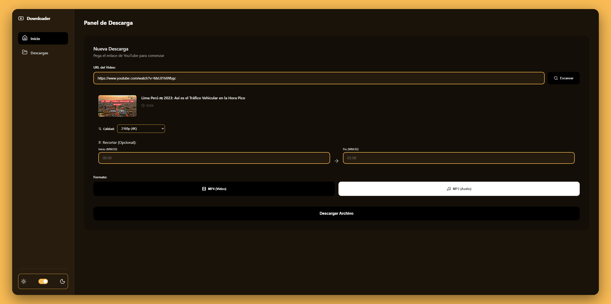

# 🎥 Downloader



[](https://www.python.org/downloads/)
[](https://fastapi.tiangolo.com/)
[](LICENSE)

Aplicación web profesional para descargar videos y audio de YouTube, Facebook, Kick, Twitch, TikTok y más en máxima calidad.

## ✨ Características

- ✅ Descarga videos en formato MP4 (hasta 4K)
- ✅ Descarga audio en formato MP3 (compatible con todos los navegadores)
- ✅ Reproductor integrado para audio y video
- ✅ Interfaz web moderna y responsive
- ✅ Notificaciones modales elegantes
- ✅ Arquitectura limpia y profesional
- ✅ Sin dependencias de frontend (Vanilla JS)
- ✅ Detección automática de FFmpeg
- ✅ Soporte para múltiples plataformas (YouTube, TikTok, Facebook, Kick, Twitch)

## Arquitectura

```
src/
├── api/              # Endpoints de la API
│   ├── __init__.py
│   └── routes.py
├── models/           # Modelos de datos (DTOs)
│   ├── __init__.py
│   └── schemas.py
├── services/         # Lógica de negocio
│   ├── __init__.py
│   └── downloader.py
├── static/           # Archivos estáticos
│   ├── css/
│   │   └── styles.css
│   └── js/
│       └── app.js
├── utils/            # Utilidades
│   ├── __init__.py
│   ├── ffmpeg_finder.py
│   └── file_utils.py
├── views/            # Templates HTML
│   └── index.html
├── __init__.py
├── app.py            # Aplicación FastAPI
├── config.py         # Configuración
└── main.py           # Punto de entrada
```

## 🚀 Inicio Rápido

### Instalación

```bash
# Clonar el repositorio
git clone https://github.com/iPool23/YouTubeDownloader_v1.0_Windows_with_yt_dlp.git
cd YouTubeDownloader_v1.0_Windows_with_yt_dlp

# Instalar dependencias
pip install -r requirements.txt

# Ejecutar la aplicación
python src/main.py
```

La aplicación se abrirá automáticamente en tu navegador en `http://127.0.0.1:8000`

### Requisitos

- Python 3.8+
- FFmpeg (opcional, para mejor calidad de video)

## 📖 Uso

1. Abre la aplicación en tu navegador
2. Pega la URL del video de YouTube
3. Selecciona el formato (MP4 o MP3)
4. Haz clic en "Descargar"
5. ¡Listo! El archivo se descargará automáticamente

## 🛠️ Tecnologías

- **FastAPI** - Framework web moderno y rápido
- **yt-dlp** - Descarga de videos de múltiples plataformas
- **Pydantic** - Validación de datos
- **Uvicorn** - Servidor ASGI
- **FFmpeg** - Procesamiento de audio y video
- **HTML/CSS/JS** - Frontend vanilla (sin frameworks)

## 🏗️ Patrones de Diseño

- **Separation of Concerns** - Separación clara entre capas
- **Dependency Injection** - Servicios inyectables
- **Repository Pattern** - Abstracción de lógica de descarga
- **DTO Pattern** - Modelos de transferencia de datos
- **Service Layer** - Lógica de negocio encapsulada

## 📚 Documentación

- [README.md](README.md) - Documentación principal
- [ARCHITECTURE.md](ARCHITECTURE.md) - Detalles de arquitectura
- [PROJECT_SUMMARY.md](PROJECT_SUMMARY.md) - Resumen del proyecto

## 🤝 Contribuir

Las contribuciones son bienvenidas. Por favor:

1. Fork el proyecto
2. Crea una rama para tu feature (`git checkout -b feature/AmazingFeature`)
3. Commit tus cambios (`git commit -m 'Add some AmazingFeature'`)
4. Push a la rama (`git push origin feature/AmazingFeature`)
5. Abre un Pull Request

## 📝 Licencia

Este proyecto está bajo la Licencia MIT. Ver el archivo `LICENSE` para más detalles.

## 👤 Autor

**Pool Anthony Deza Millones**

Desarrollador de la interfaz e integración completa del sistema.

- GitHub: [@iPool23](https://github.com/iPool23)

## ⭐ Agradecimientos

- [yt-dlp](https://github.com/yt-dlp/yt-dlp) - Por la excelente librería de descarga
- [FastAPI](https://fastapi.tiangolo.com/) - Por el increíble framework

---

⭐ Si te gusta este proyecto, dale una estrella en GitHub!
